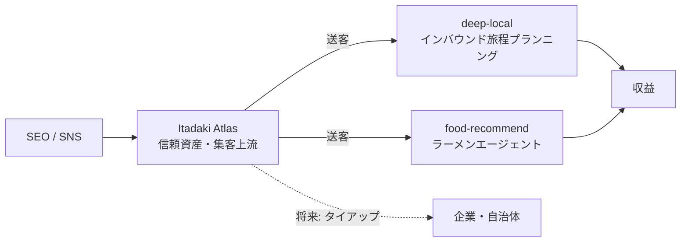

# 目的

Itadaki Atlas が何を成すプロダクトなのか、なぜ必要なのか、どの順で作るのかを定義する。事業理念・背景・解決する課題の一次情報。

## 1. プロダクト定義

**日本の食の地理データベース。**

日本食を超細分類し、歴史と発祥地を日本地図にマッピングして紹介するWebサイト。主対象は海外（英語圏）ユーザー。将来的には料理だけでなく、ブランド牛・地鶏・酒・土産品など**調理前の食材・産品**まで含む。

「レシピサイト」でも「グルメ口コミサイト」でもなく、**土地と食の因果を記録するリファレンス**である。

## 2. 解決する課題（3つのミッション）

| # | ミッション | 解決する不便 |
| :--- | :--- | :--- |
| **①** | **発祥・産地のマッピング** | 「この料理はどこで生まれたのか」が英語圏に整理された形で存在しない |
| **②** | **メニュー解読** | 「せせり」「紅生姜串」——何を食べているか分からないから注文できない、という体験上の壁 |
| **③** | **地域の食の物語** | 「コメがうまい土地は飯も酒もうまい」のような、**土地を主語にした因果**の解説が不在 |

②は旅行者の体験を直接改善し、③は SEO における第二の正面（"what to eat in Niigata" 系クエリ）を作る。①はその両方を支えるデータ基盤にあたる。

## 3. 品質基準

**「日本人としても見たいレベル」。**

雑煮の地域差や出汁の東西のように、国内でも話題になる深さを狙う。英語圏向けだからと浅くしない。この基準を守ることで日本語版自体が主力コンテンツとなり、国内トラフィックも取れる。

## 4. 戦略的位置づけ

単体収益を目的としない。**IA MIRACOLO の既存事業への集客上流・信頼資産**として位置づける。

SEO でコンテンツ流入を作り、送客・予約・タイアップに繋げる。詳細なマネタイズ方針は `.doc/00_concept/04_strategy.md`。

### 成長モデル: 浅い人を、深く／広くに育てる窓口

このサイトの仕事は**浅い認知の人（"ramen" しか知らない）を受け取り、2方向に育てて後段へ渡す**こと。

| 方向 | 中身 | サイト内の実体 | 出口 |
| :--- | :--- | :--- | :--- |
| **深くする** | 同ジャンル内の系統・派生へ（味噌とは、源流の久留米とは） | ジャンル軸・つながり（源流⇄派生） | `food-recommend` |
| **広くする** | 土地・他ジャンルへ（この県には他に何がある） | エリア軸・地域ページ・同県リンク | `deep-local` |

出口サービスは後追いで整備する。**現段階の目標はトラフィック資産の成長**であり、最適化するのは着地の質・共有されやすさ・1セッションの回遊の深さ。

## 5. 差別化

TasteAtlas 等の既存サービスに対し、次の3点で差別化する。

1. **日本特化の深さ** — ご当地ラーメン約180種の網羅。家系・二郎系より細かい粒度で英語圏に整理されたコンテンツは現状存在しない
2. **地図体験の美しさ** — スマホファーストのフルスクリーン地図＋ボトムシート（`.doc/30_features/02_ui_ux.md`）
3. **実際に案内できる出口** — 既存事業という送客先を持つ。メディア単体の競合には構造上模倣できない

競合分析の詳細は `.doc/00_concept/03_market.md`。

## 6. スコープ（フェーズ分け）

### フェーズ1（MVP）— 初期実装対象

- ご当地ラーメン**約180種**を地図＋索引に掲載（名前・発祥地・座標・主系統・一言説明）
- **写真なしで開始**（系統色アイコンで代用）
- スマホファーストの地図UXを確立
- 英日2言語
- 事業者問い合わせフォーム（待ちの営業の受け皿）

### フェーズ2

- 詳細属性の拡充（特徴タグ・麺・濃度・歴史・元祖店・イラスト）。属性は読み物ではなく**フィルタとして機能する構造化タグ**で設計する
- 地域ページの**読み物化**（ページ自体は実装済み。地の文を旗艦＝金沢/石川から書き始める）
- `food-recommend`（ラーメンエージェント）の好みマッチングとのデータ連携

### フェーズ3以降

- 他ジャンル展開（dish列挙型 / 食材展開型の2類型）
- アカウント機能（制覇マップ・行きたいリスト・旅程変換）
- アプリ化（Capacitor構成を `food-recommend` から流用）

登り順と判断基準は `.doc/99_management/01_roadmap.md`。

## 7. 対象外

- **食以外の題材**（温泉等）。ただし温泉地×食（湯豆腐・温泉卵・地獄蒸し）のような**食側からの接続は可**
- 純粋な温泉マップは Itadaki ブランドの別サービスとして将来検討する（本プロダクトのスコープ外）
- コメント欄（`.doc/40_operation/01_strategy.md` に理由と再検討条件）
