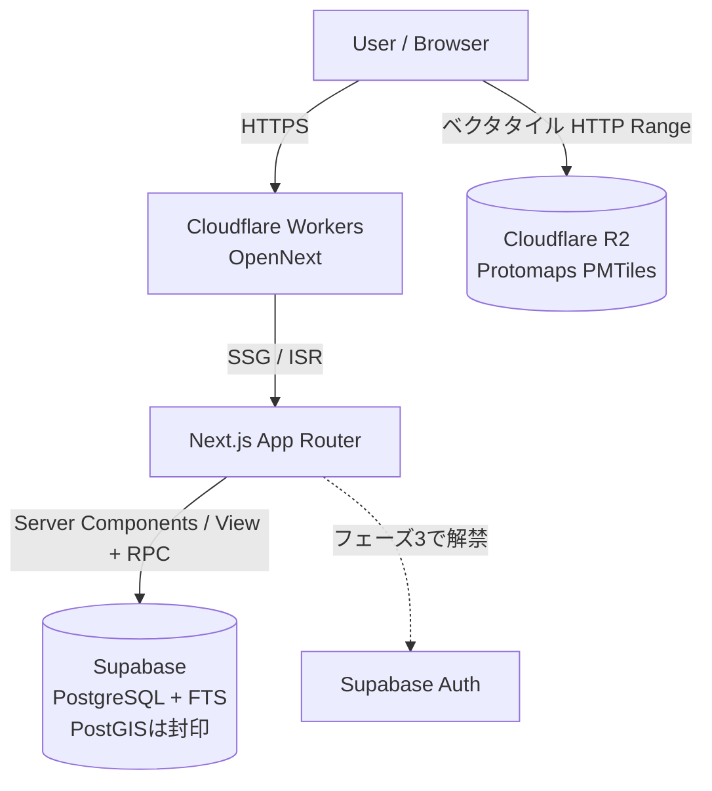

# 目的

Itadaki Atlas の技術構成のうち、**Platform の固定スタックからの差分**だけを定義する。共通部分（Next.js App Router / TypeScript strict / Tailwind + shadcn/ui / Supabase / zod + react-hook-form / date-fns / Vitest + Playwright）は再掲しない。

参照する Platform ファイル:

- `../.doc/10_system/01_architecture.md` — 固定スタックと構成戦略（本ファイルの前提）
- `../.doc/10_system/05_libraries.md` — 固定スタックライブラリ一覧
- `../.doc/10_system/02_infrastructure.md` — ホスティング方針・ポータビリティ規約
- `../.doc/10_system/06_security.md` — 認証フロー・RLS必須方針・鍵管理・CSP・リリース前チェック
- `../.doc/10_system/10_growth_infra.md` — 国際化（i18n）の共通方針
- `../.doc/20_data/02_migrations.md` — マイグレーション運用・**型生成**・ORMを採らない共通方針

## 1. 追加ライブラリ（Platform に無いもの）

本プロダクトは「地図を主UIとする地理データベース」であり、Platform が想定していない領域のライブラリを要する。

| ライブラリ | 用途 | 選定理由 |
| :--- | :--- | :--- |
| **MapLibre GL JS** | 地図描画 | ベクタタイルによる滑らかなズーム。Mapbox GL のOSSフォークで**ベンダロックインが無く**、タイル提供元を差し替え可能（ポータビリティ規約に適合） |
| **Framer Motion** | ボトムシート・地図切替のアニメーション | ドラッグ可能な3段階スナップシート（`.doc/30_features/02_ui_ux.md`）は CSS transition では実装が破綻する。ジェスチャとスプリング物理が必要 |

これらは本プロダクト固有であり、2プロダクト目で必要になった時点で Platform への昇格を検討する（`../.doc/documentation_rules.md` §6A）。

## 2. データ層の差分

### 2.1 PostgreSQL 拡張

**フェーズ1では拡張を追加しない。** 素の PostgreSQL で構成する。

| 機能 | フェーズ1の実装 | 判断 |
| :--- | :--- | :--- |
| 地図表示（約180件のピン描画） | `lat` / `lng` を素の数値列（`double precision`）で保持。絞り込みが要る場合は緯度経度の範囲比較（バウンディングボックス） | **PostGIS 不要。** フェーズ1のUXは「全件をピン表示」「索引で引く」であり、半径検索・距離ソートがスコープに無い |
| 検索（アイテム名・説明文） | Postgres 組み込みの FTS | 標準機能。拡張のインストール不要 |

#### PostGIS の封印と解禁条件

| 項目 | 内容 |
| :--- | :--- |
| **封印するもの** | PostGIS 拡張、`geography` / `geometry` 型の列、地理インデックス |
| **理由** | フェーズ1に半径検索・距離ソートの要件が無く、約180件の規模では素の数値比較で足りる。最初から入れるとローカル開発環境・ホスティング選定の前提が1つ増える |
| **解禁条件** | 「現在地から近いものを探す」「距離順に並べる」が要件化した時点（フェーズ2以降を想定） |
| **解禁コスト** | 低い。拡張を有効化し、既存の `lat`/`lng` から生成列とインデックスを足すだけで移行できる。**この移行しやすさを保つため、座標は最初から素の数値列で持つ**（`geography` 型で保存しない） |

- **Elasticsearch は不採用。** 約180件〜将来数千件の規模に対して運用コストが見合わない
- 検索精度が要件を満たさなくなった場合に限り **Meilisearch の後乗せ**を検討する。そのため検索処理はアプリ層で1箇所に隔離し、差し替え可能に保つ

### 2.2 JSONB を採用しない

ジャンルごとに異なる詳細属性を JSONB で持つ設計は**採らない**。後から型安全化するコストが、初期のスキーマ設計コストを上回るためである。

代わりに「**共通コア + タイプ別詳細テーブル**」構成を取る。詳細は `.doc/20_data/01_models.md`。

### 2.3 複雑クエリは View + RPC

ORM は使わない（Platform `../.doc/20_data/02_migrations.md` §2 の既定どおりで差分なし）。

本プロダクトで View / RPC が必要になるのは `food_item_relations` / `food_item_regions` の多対多の辿り（例: 江戸前寿司↔コハダ、讃岐うどん＝発祥:香川＋主要提供圏:全国）。設計は `.doc/20_data/01_models.md`。

## 3. 認証の封印

**フェーズ1〜2は認証を実装しない。** 理由と解禁条件を差分として記録する（`../.doc/documentation_rules.md` §4B）。

| 項目 | 内容 |
| :--- | :--- |
| **封印するもの** | Supabase Auth、ユーザーテーブル、ログイン導線、RLSのユーザー単位ポリシー |
| **理由** | フェーズ1〜2に認証を要する機能が無い。注目度分析は GA のページトラッキングで足り、お気に入りは localStorage（端末内保存）で提供できる |
| **解禁条件** | **制覇マップ**（食べたご当地グルメの塗りつぶし）を実装する時点。端末を跨いで永続させたいデータであり、ユーザーが自発的に登録する動機になる唯一の機能 |
| **前提の固定** | 解禁時は **Supabase Auth** を使う（Platform 既定どおり）。将来 `deep-local` / `food-recommend` と IA MIRACOLO 共通アカウント化する構想があり、DBと同一基盤で複数サービス共有が可能なため |

公開データのみを扱う間も、**テーブルには RLS を必ず設定する**（Platform `06_security.md`。匿名読み取り許可 + 書き込み拒否）。RLS ポリシーの詳細は本ファイル §4（セキュリティ）。

## 4. セキュリティ

共通方針: `../.doc/10_system/06_security.md`（認証フロー・RLS必須方針・鍵管理・CSP・リリース前チェック）

Itadaki Atlas のテーブル別 RLS ポリシーと脅威モデルを定義する。共通のセキュリティ方針（RLS必須・鍵管理・CSP）は Platform が正であり、本節は**その具体化のみ**を持つ。

### 4.1 前提: 公開データのみ・認証なし

フェーズ1〜2は認証を実装しない（本ファイル §3）。扱うデータは**すべて公開を前提とした編集コンテンツ**であり、個人情報・要配慮情報を保持しない。

これにより脅威モデルは大きく単純化されるが、**RLS の設定を省略しない**。Platform §2「RLSポリシーなしでのテーブル追加を禁止」は認証の有無に関わらず適用される。

理由は2つ。

1. `anon key` はクライアントに露出する。RLS が無ければ**誰でも全テーブルを直接読み書きできる**
2. フェーズ3で認証を解禁した際、RLS未設定のテーブルが残っていると穴になる

### 4.2 テーブル別 RLS ポリシー

#### 4.2.1 基本形（フェーズ1〜2の全テーブル）

| 操作 | ポリシー |
| :--- | :--- |
| `select` | **`status = 'published'` の行のみ匿名許可** |
| `insert` / `update` / `delete` | **全拒否**（匿名・認証済みを問わず） |

書き込みは `service_role` key を使うサーバー側の処理（CSVインポート・管理オペレーション）のみが行う。鍵の扱いは Platform §3。

#### 4.2.2 テーブル別の適用

| テーブル | select | 備考 |
| :--- | :--- | :--- |
| `food_items` | `status = 'published'` のみ | **`draft` を漏らさないことが最重要。** 未確認の情報が公開されると North Star（正確さ）を直接毀損する |
| `food_item_translations` | 親の `food_items.status = 'published'` のみ | 親を辿って判定する |
| `food_item_sources` | 同上 | |
| `dish_details` | 同上 | |
| `food_item_regions` | 同上 | |
| `food_item_relations` | **両端**の `food_items.status = 'published'` のみ | 片側が draft のリレーションを露出させない |
| `genres` | 全行許可 | マスタ。非公開情報を含まない |
| `shops`（フェーズ2〜） | 全行許可 | 掲載店舗情報。ただし `sponsored_until` 期限切れはアプリ側で除外 |

**`food_item_relations` は両端を判定する**点に注意。片側だけを見ると、未公開アイテムの存在（名前・ID）が推測できてしまう。

#### 4.2.3 問い合わせフォーム

事業者問い合わせフォームは**DBに保存せず、メール通知のみ**とする（`.doc/30_features/01_requirements.md` F-06）。

保存しないことで、問い合わせ内容（企業名・担当者名・連絡先＝個人情報）を DB に持たずに済み、RLS 設計とプライバシーポリシーの負担を回避する。フェーズ1で管理画面を作らない判断とも整合する。

`TODO: [問い合わせ件数が増え、メールでの管理が破綻した段階でDB保存を検討する。その時点で個人情報を扱うことになるため、RLSポリシーとプライバシーポリシーへの記載をセットで行う（Platform §4）]`

### 4.3 脅威モデル

| 脅威 | 影響度 | 対策 |
| :--- | :--- | :--- |
| **`draft` コンテンツの漏洩** | **高** | RLS で `status` 判定（§4.2）。未確認情報の公開は信頼を直接毀損する |
| `service_role` key の露出 | **高** | サーバー環境変数のみ。クライアントバンドルに含めない。`.env.local` を git 管理下に置かない |
| フォームスパム | 中 | `TODO: [Cloudflare Turnstile 等のbot対策を導入するか、公開後のスパム実態を見て判断する]` |
| データの改ざん | 低 | 書き込みを全拒否しているため、`service_role` key が漏れない限り発生しない |
| DoS / 高負荷 | 低 | Cloudflare 前段で吸収。地図タイルは R2 の静的ファイル |

**個人情報の漏洩は脅威リストに載らない。** 個人情報を保持しない設計にしているため（§4.2.3）。この状態を維持することが最も安価な対策である。

### 4.4 リリース前チェック

Platform §5 に加えて、本プロダクト固有で確認する項目。

- [ ] 全テーブルで RLS が有効になっているか
- [ ] `anon key` で `draft` の行が取得**できない**ことを実際に確認したか
- [ ] `service_role` key がクライアントバンドルに含まれていないか
- [ ] Platform §5 のリリース前チェックを実施したか

## 5. ホスティングと地図タイル配信

選定結果と根拠は `.doc/10_system/02_infrastructure.md`。ホスティング自体は Platform 既定（`../.doc/10_system/02_infrastructure.md`）に従うため差分なし。

## 6. 成長基盤

共通方針: `../.doc/10_system/10_growth_infra.md`（A/Bテスト・Feature Flag・i18n の共通方針。ライブラリ選定・サブパス方式・翻訳の二層方式はここが正）

Itadaki Atlas における A/Bテスト・Feature Flag・国際化（i18n）の適用状況を、**Platform の共通方針からの差分として**記録する。

### 6.1 A/Bテスト・Feature Flag

**差分なし。導入しない。** Platform §1・§2 の既定どおり。フェーズ1〜2のトラフィック規模では統計的有意性が得られないため。

### 6.2 国際化（i18n）

方式は Platform §3 に全面的に従う（`next-intl` / サブパス方式 / 手動切り替え / hreflang / 二層方式）。本プロダクト固有の事項のみ以下に記す。

#### 6.2.1 対象言語

| locale | フェーズ | 位置づけ |
| :--- | :--- | :--- |
| `en` | 1 | **主対象。** 海外（英語圏）ユーザー向けが本プロダクトの主戦場 |
| `ja` | 1 | 品質基準「日本人としても見たいレベル」の担保対象であり、国内トラフィックを取る主力コンテンツでもある（`.doc/00_concept/02_vision.md` §3）。**おまけではない** |
| `zh-Hant` | 未定 | 構造上追加可能にしておく。着手判断はフェーズ2以降 |
| `ko` | 未定 | 同上 |

フォールバックの言語ペアは `en` → `ja`（処理方式は Platform §3.3）。

`TODO: [zh-Hant / ko の着手可否を、フェーズ2のトラフィック実績（GSCの国別インプレッション）を見て判断する]`

#### 6.2.2 翻訳テーブル

Platform §3.3 の二層方式を、本ドメインでは次のように実装する。

| 種別 | 実体 | 対象 |
| :--- | :--- | :--- |
| 自由記述 | `food_item_translations`（`food_item_id` + `locale` の複合ユニーク） | 名称・要約・歴史 |
| マスタラベル | アプリの i18n 辞書ファイル | 系統名（醤油・味噌・塩・豚骨）、特徴タグ、都道府県名、UI文言 |

`food_items` コア側は**言語非依存の情報のみ**を持つ（`slug` は英語ベース1本、`name_romaji` は言語ではなく転写のためコア側）。スキーマ全体は `.doc/20_data/01_models.md`。

#### 6.2.3 名称表記ルール

多言語対応と直結する固有ルールとして、**「日本語名 — ローマ字 — 英訳」の三点セット**で表記する。日本語メニューとの照合可能性を担保するためであり、これが無いと本プロダクトのミッション②（メニュー解読）が成立しない。

- 英訳は直訳ではなく**説明訳**とする
  - 例: せせり → `Seseri — chicken neck meat`
  - 例: 家系 → `Iekei — rich pork-soy broth style`

### 6.3 対象読者の非対称性（運用上の差分）

多言語だが、**すべての機能を全言語で提供するわけではない**。

- **事業者問い合わせフォームは日本語表示時のみ**。出稿者はほぼ国内のため
- 英語版はフッターに `For business inquiries` のメールリンク1行のみを残し、海外レストラン・メディアからの想定外リードを拾う

詳細は `.doc/40_operation/01_strategy.md`。

## 7. アーキテクチャ概要

Platform の構成（`../.doc/10_system/01_architecture.md` §3）に、地図タイル配信を加えたもの。

Platform の原則（データ取得はサーバー側 / 外部境界に zod / ベンダ固有APIを直書きしない）はそのまま適用する。

## 8. TODO 一覧

- [x] ~~i18n ライブラリを選定する~~ → `next-intl` に決定し、Platform `10_growth_infra.md` §3 へ還元済み
- [x] ~~PostGIS を初期から入れるか~~ → **フェーズ1では封印**（§2.1）。解禁条件は「半径検索・距離ソートの要件化」
- [x] ~~ホスティングを選定する~~ → Platform 既定どおり **Cloudflare Workers（OpenNext）**（§5）
- [x] ~~地図タイルの配信構成を確定する~~ → **Protomaps（PMTiles）を R2 から配信**に決定（§5）
- `TODO: [地図タイル構成とコスト試算3点（.doc/10_system/02_infrastructure.md §3）のユーザー承認を、M2 着手前に取得する]`
- [ ] ディフォルメ地図の実装方式を決定する（自前SVG or ライブラリ。M4 着手前。`.doc/30_features/02_ui_ux.md`）
