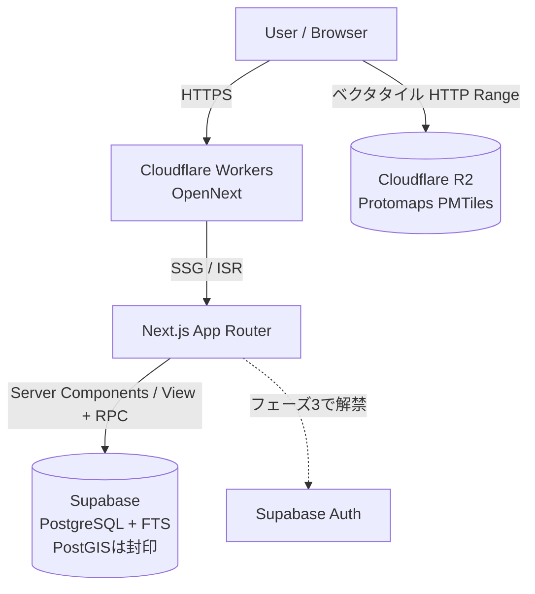

# 目的

Itadaki Atlas の技術構成のうち、**Platform の固定スタックからの差分**だけを定義する。共通部分（Next.js App Router / TypeScript strict / Tailwind + shadcn/ui / Supabase / zod + react-hook-form / date-fns / Vitest + Playwright）は再掲しない。

参照する Platform ファイル:

- `../.doc/10_system/01_architecture.md` — 固定スタックと構成戦略（本ファイルの前提）
- `../.doc/10_system/05_libraries.md` — 固定スタックライブラリ一覧
- `../.doc/10_system/02_infrastructure.md` — ホスティング方針・ポータビリティ規約
- `../.doc/10_system/10_growth_infra.md` — 国際化（i18n）の共通方針
- `../.doc/20_data/02_migrations.md` — マイグレーション運用・**型生成**・ORMを採らない共通方針

## 1. 追加ライブラリ（Platform に無いもの）

本プロダクトは「地図を主UIとする地理データベース」であり、Platform が想定していない領域のライブラリを要する。

| ライブラリ | 用途 | 選定理由 |
| :--- | :--- | :--- |
| **MapLibre GL JS** | 地図描画 | ベクタタイルによる滑らかなズーム。Mapbox GL のOSSフォークで**ベンダロックインが無く**、タイル提供元を差し替え可能（ポータビリティ規約に適合） |
| **Framer Motion** | ボトムシート・地図切替のアニメーション | ドラッグ可能な3段階スナップシート（`.doc/30_features/02_ui_ux.md`）は CSS transition では実装が破綻する。ジェスチャとスプリング物理が必要 |

これらは本プロダクト固有であり、2プロダクト目で必要になった時点で Platform への昇格を検討する（`../.doc/documentation_rules.md` §6A）。

## 2. データ層の差分

### 2.1 PostgreSQL 拡張

**フェーズ1では拡張を追加しない。** 素の PostgreSQL で構成する。

| 機能 | フェーズ1の実装 | 判断 |
| :--- | :--- | :--- |
| 地図表示（約180件のピン描画） | `lat` / `lng` を素の数値列（`double precision`）で保持。絞り込みが要る場合は緯度経度の範囲比較（バウンディングボックス） | **PostGIS 不要。** フェーズ1のUXは「全件をピン表示」「索引で引く」であり、半径検索・距離ソートがスコープに無い |
| 検索（アイテム名・説明文） | Postgres 組み込みの FTS | 標準機能。拡張のインストール不要 |

#### PostGIS の封印と解禁条件

| 項目 | 内容 |
| :--- | :--- |
| **封印するもの** | PostGIS 拡張、`geography` / `geometry` 型の列、地理インデックス |
| **理由** | フェーズ1に半径検索・距離ソートの要件が無く、約180件の規模では素の数値比較で足りる。最初から入れるとローカル開発環境・ホスティング選定の前提が1つ増える |
| **解禁条件** | 「現在地から近いものを探す」「距離順に並べる」が要件化した時点（フェーズ2以降を想定） |
| **解禁コスト** | 低い。拡張を有効化し、既存の `lat`/`lng` から生成列とインデックスを足すだけで移行できる。**この移行しやすさを保つため、座標は最初から素の数値列で持つ**（`geography` 型で保存しない） |

- **Elasticsearch は不採用。** 約180件〜将来数千件の規模に対して運用コストが見合わない
- 検索精度が要件を満たさなくなった場合に限り **Meilisearch の後乗せ**を検討する。そのため検索処理はアプリ層で1箇所に隔離し、差し替え可能に保つ

### 2.2 JSONB を採用しない

ジャンルごとに異なる詳細属性を JSONB で持つ設計は**採らない**。後から型安全化するコストが、初期のスキーマ設計コストを上回るためである。

代わりに「**共通コア + タイプ別詳細テーブル**」構成を取る。詳細は `.doc/20_data/01_models.md`。

### 2.3 複雑クエリは View + RPC

ORM は使わない（Platform `../.doc/20_data/02_migrations.md` §2 の既定どおりで差分なし）。

本プロダクトで View / RPC が必要になるのは `food_item_relations` / `food_item_regions` の多対多の辿り（例: 江戸前寿司↔コハダ、讃岐うどん＝発祥:香川＋主要提供圏:全国）。設計は `.doc/20_data/01_models.md`。

## 3. 認証の封印

**フェーズ1〜2は認証を実装しない。** 理由と解禁条件を差分として記録する（`../.doc/documentation_rules.md` §4B）。

| 項目 | 内容 |
| :--- | :--- |
| **封印するもの** | Supabase Auth、ユーザーテーブル、ログイン導線、RLSのユーザー単位ポリシー |
| **理由** | フェーズ1〜2に認証を要する機能が無い。注目度分析は GA のページトラッキングで足り、お気に入りは localStorage（端末内保存）で提供できる |
| **解禁条件** | **制覇マップ**（食べたご当地グルメの塗りつぶし）を実装する時点。端末を跨いで永続させたいデータであり、ユーザーが自発的に登録する動機になる唯一の機能 |
| **前提の固定** | 解禁時は **Supabase Auth** を使う（Platform 既定どおり）。将来 `deep-local` / `food-recommend` と IA MIRACOLO 共通アカウント化する構想があり、DBと同一基盤で複数サービス共有が可能なため |

公開データのみを扱う間も、**テーブルには RLS を必ず設定する**（Platform `06_security.md`。匿名読み取り許可 + 書き込み拒否）。RLS ポリシーの詳細は `.doc/10_system/06_security.md`。

## 4. ホスティングと地図タイル配信

選定結果と根拠は `.doc/10_system/02_infrastructure.md`。ホスティング自体は Platform 既定（`../.doc/10_system/02_infrastructure.md`）に従うため差分なし。

## 5. アーキテクチャ概要

Platform の構成（`../.doc/10_system/01_architecture.md` §3）に、地図タイル配信を加えたもの。

Platform の原則（データ取得はサーバー側 / 外部境界に zod / ベンダ固有APIを直書きしない）はそのまま適用する。

## 6. TODO 一覧

- [x] ~~i18n ライブラリを選定する~~ → `next-intl` に決定し、Platform `10_growth_infra.md` §3 へ還元済み
- [x] ~~PostGIS を初期から入れるか~~ → **フェーズ1では封印**（§2.1）。解禁条件は「半径検索・距離ソートの要件化」
- [x] ~~ホスティングを選定する~~ → Platform 既定どおり **Cloudflare Workers（OpenNext）**（§4）
- [x] ~~地図タイルの配信構成を確定する~~ → **Protomaps（PMTiles）を R2 から配信**に決定（§4）
- `TODO: [地図タイル構成とコスト試算3点（.doc/10_system/02_infrastructure.md §3）のユーザー承認を、M2 着手前に取得する]`
- [ ] ディフォルメ地図の実装方式を決定する（自前SVG or ライブラリ。M4 着手前。`.doc/30_features/02_ui_ux.md`）
