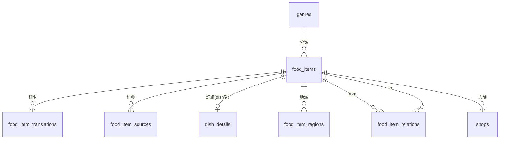

# 目的

Itadaki Atlas のデータモデルを定義する。テーブル定義・リレーション・フェーズ別の実装範囲の一次情報源であり、マイグレーション作成時は本ファイルを先に更新する（Platform `../.doc/20_data/02_migrations.md` §1）。

## 1. 設計方針

### 1.1 共通コア + タイプ別詳細テーブル

ジャンル（ラーメン / 寿司 / 焼き鳥 …）ごとに必要な属性が異なるが、**JSONB で可変属性を持つ設計は採らない**。後から型安全化するコストが、初期のスキーマ設計コストを上回るためである。

```
food_items（共通コア）── dish_details（dish型の詳細）
                     └─ 将来: ingredient_details 等（ジャンルごとに要否を判断）
```

他ジャンル展開時は、既存の詳細テーブルで賄えるか（例: 洋食は `dish_details` を流用可）を都度判断する。**構成合わせのために空のテーブルを作らない。**

### 1.2 座標は素の数値列で持つ

`lat` / `lng` は `double precision` の素の列とする（PostGIS封印の理由と解禁条件は `.doc/10_system/01_architecture.md` §2.1）。

### 1.3 言語の扱い

`food_items` は**言語非依存の情報のみ**を持ち、翻訳は別テーブルに分離する（`.doc/10_system/10_growth_infra.md` §2.2）。

- `slug` は英語ベース1本で言語共通
- `name_romaji` は「言語」ではなく「転写」のためコア側に置く

### 1.4 複雑クエリは View + RPC

多対多の辿りは ORM ではなく Postgres の View / RPC（関数）で解く（`.doc/10_system/01_architecture.md` §2.3）。

## 2. ER図



## 3. テーブル定義

### 3.1 `food_items` — 共通コア

地図・索引・検索が読む唯一のソース。

| カラム | 型 | 制約 | 内容 |
| :--- | :--- | :--- | :--- |
| `id` | uuid | PK | |
| `slug` | text | UNIQUE, NOT NULL | URL に使う。英語ベース1本で言語共通 |
| `type` | text | NOT NULL | `dish` \| `ingredient` |
| `genre_id` | uuid | FK → `genres` | |
| `name_romaji` | text | NOT NULL | ローマ字転写。言語ではなく転写のためコア側 |
| `origin_pref` | text | **NULL可** | 発祥地（都道府県） |
| `origin_city` | text | **NULL可** | 発祥地（市町村） |
| `lat` | double precision | **NULL可** | §1.2 |
| `lng` | double precision | **NULL可** | §1.2 |
| `status` | text | NOT NULL, default `draft` | `draft` \| `published` |

**発祥地・座標が NULL 可である理由:** 焼き鳥の部位（せせり・ぼんじり）や串カツの定番種（紅生姜）など、**発祥地の物語を持たないアイテム**に対応するため。地域性ありは「地図＋索引」、地域性なしは「索引＋親ジャンルページ」に表示する。

### 3.2 `food_item_translations` — 自由記述の翻訳

| カラム | 型 | 制約 | 内容 |
| :--- | :--- | :--- | :--- |
| `food_item_id` | uuid | FK | |
| `locale` | text | | `ja` \| `en`（将来 `zh-Hant` \| `ko`） |
| `name` | text | NOT NULL | |
| `summary` | text | | 一言説明 |
| `history` | text | | 歴史（フェーズ2） |

複合ユニーク `(food_item_id, locale)`。

マスタラベルの扱いは `.doc/10_system/10_growth_infra.md` §2.2。

### 3.3 `food_item_sources` — 出典

| カラム | 型 | 内容 |
| :--- | :--- | :--- |
| `food_item_id` | uuid | FK |
| `url` | text | |
| `title` | text | |
| `publisher` | text | |
| `accessed_at` | date | 参照日 |

記事末尾に参考文献として自動表示する。`genres` 側にも `default_source` を持たせ、ジャンル共通出典の一括適用に対応する。

**参照するのは事実のみで、文章表現は必ず書き直す**（転載禁止。`.doc/40_operation/01_strategy.md`）。

### 3.4 `genres` — ジャンルマスタ

| カラム | 型 | 内容 |
| :--- | :--- | :--- |
| `id` | uuid | PK |
| `slug` | text | **URLルーティングにそのまま使う**（`/ramen`） |
| `name_ja` / `name_en` | text | マスタ小規模のためカラム方式のまま持つ |
| `type` | text | `dish` \| `ingredient` |
| `sort_order` | int | |
| `default_source` | text | ジャンル共通の出典 |

### 3.5 `dish_details` — dish型の詳細（フェーズ2で本格使用）

| カラム | 型 | フェーズ1 | 内容 |
| :--- | :--- | :--- | :--- |
| `food_item_id` | uuid | ✅ | PK / FK |
| `primary_style` | text | **✅ 入力する** | 主系統（醤油 \| 味噌 \| 塩 \| 豚骨 \| その他）。単一選択 |
| `feature_tags` | — | スキーマのみ | 特徴タグ（複数可）。別テーブルで持つ |
| `noodle_thickness` | — | スキーマのみ | 麺の太さ |
| `noodle_curl` | — | スキーマのみ | 麺の縮れ |
| `richness` | — | スキーマのみ | あっさり⇔こってりの段階値 |
| `originator_shop` | — | スキーマのみ | 元祖店 |

**フェーズ1で入力するのは `primary_style` のみ。** 他はスキーマだけ用意する。

属性は読み物ではなく**フィルタとして機能する構造化タグ**として設計する（「こってり × 太麺だけ表示」を成立させるため）。

### 3.6 `food_item_regions` — 地域リレーション（型付き）

| カラム | 型 | 内容 |
| :--- | :--- | :--- |
| `food_item_id` | uuid | FK |
| `pref` / `city` | text | |
| `lat` / `lng` | double precision | |
| `relation_type` | text | `発祥` \| `名産地` \| `主要提供圏` |
| `is_representative` | boolean | **代表名物フラグ（フェーズ2）** |

1アイテムが複数の地域と異なる関係を持つ場合を表現する。

- 讃岐うどん = 発祥:香川 + 主要提供圏:全国
- マグロ = 複数の名産地（大間 / 那智勝浦 / 三崎）

**代表名物フラグ**は「秋田＝きりたんぽ」のような看板アイテムを地域ページ冒頭・県タップ時に最優先表示するためのもの。県レベルとエリアレベルで代表が変わる（石川県 / 金沢 / 能登）ため、`food_items` ではなく本テーブル側に持たせる。

### 3.7 `food_item_relations` — アイテム間リンク（全ジャンル横断）

| カラム | 型 | 内容 |
| :--- | :--- | :--- |
| `from_id` / `to_id` | uuid | FK → `food_items` |
| `relation_type` | text | `代表ネタ` \| `使用食材` \| `派生` など |

江戸前寿司↔コハダ、味噌カツ↔八丁味噌、ラーメン↔ブランド地鶏のような**双方向回遊**を実現する。ジャンル横断回遊率（`.doc/20_data/03_log_design.md`）を支える中核テーブル。

### 3.8 `shops` — 店舗（フェーズ2以降。スキーマ予約のみ）

| カラム | 型 | 内容 |
| :--- | :--- | :--- |
| `id` | uuid | PK |
| `name` | text | |
| `food_item_id` | uuid | FK |
| `lat` / `lng` | double precision | |
| `role` | text | `originator`（元祖・編集掲載） \| `sponsored`（広告枠） |
| `sponsored_until` | date | 広告枠の掲載期限 |

`sponsored` は**ページ最上部の1枠限定 + 「PR」表記を必須表示**する。編集掲載（元祖店）とは別枠として扱い、中立性を保つ（`.doc/00_concept/01_north_star.md` §2）。

## 4. 粒度の方針

データは最初から**市町村 + 座標**で保持する。表示は当面県単位とし、地図のズームでエリア表示に切り替える。座標は市町村役場等の代表点でよい。

## 5. フェーズ別の実装範囲

| テーブル | フェーズ1 | 備考 |
| :--- | :--- | :--- |
| `genres` | ✅ 作成・投入 | ラーメン1件のみ |
| `food_items` | ✅ 作成・投入 | 約180件 |
| `food_item_translations` | ✅ 作成・投入 | `ja` / `en` |
| `food_item_sources` | ✅ 作成・投入 | |
| `dish_details` | ✅ 作成 | `primary_style` のみ投入 |
| `food_item_regions` | ⬜ 作成のみ | フェーズ1は `food_items` の発祥地で足りる |
| `food_item_relations` | ⬜ 作成のみ | ジャンル横断が発生するフェーズ2から |
| `shops` | ⬜ **作成しない** | スキーマ予約のみ。フェーズ2で作成 |

`TODO: [食材展開型（寿司×ネタ等）の詳細テーブル構造は、フェーズ3のジャンル選定時に設計する。ネタ固有情報（魚種・旬・仕込み方）を専用詳細テーブルで持ち、産地は food_item_regions（relation_type=名産地）、スタイル↔ネタの紐付けは food_item_relations で表現する方針まで決定済み]`

## 6. RLS

全テーブルに RLS を有効化する（Platform `../.doc/10_system/06_security.md`）。フェーズ1〜2は認証を持たないため、ポリシーは「`status = 'published'` の行のみ匿名読み取り可・書き込み全拒否」となる。詳細は `.doc/10_system/06_security.md`。
